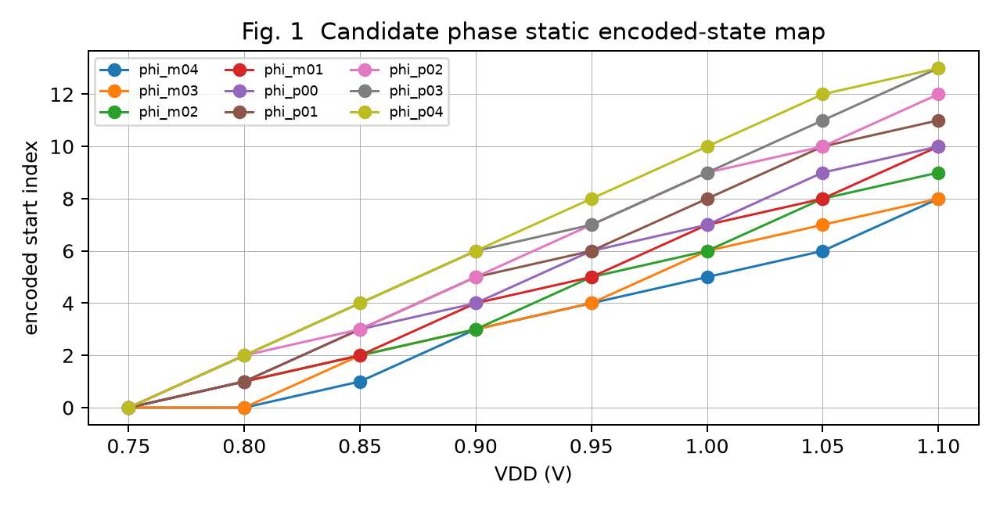
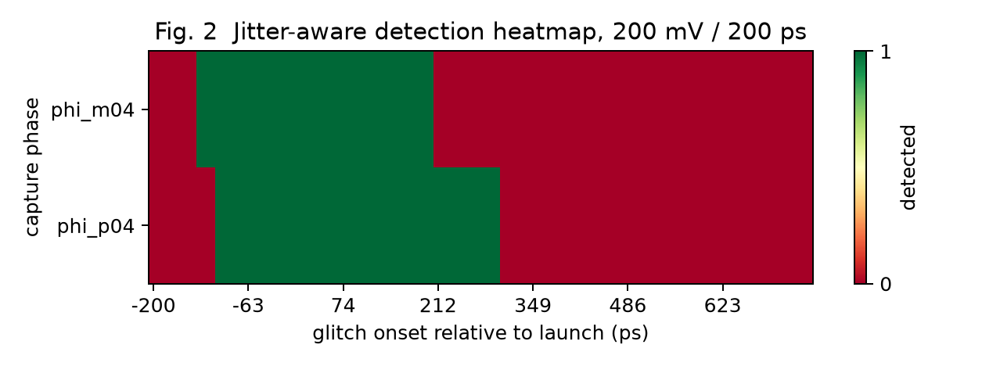
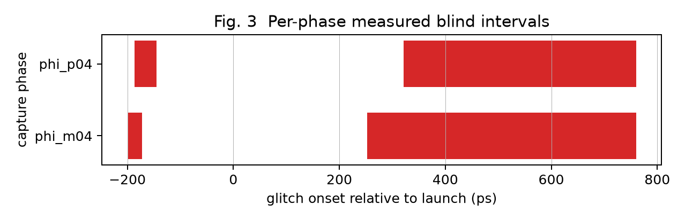
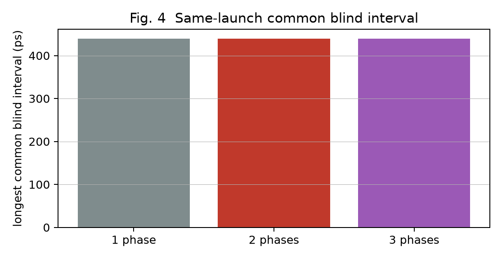
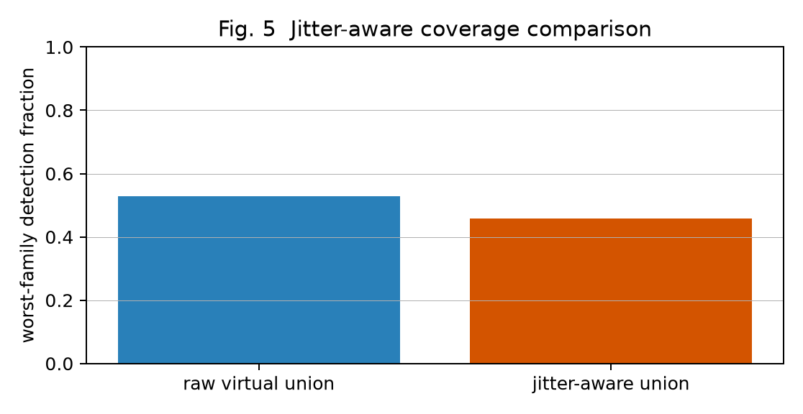
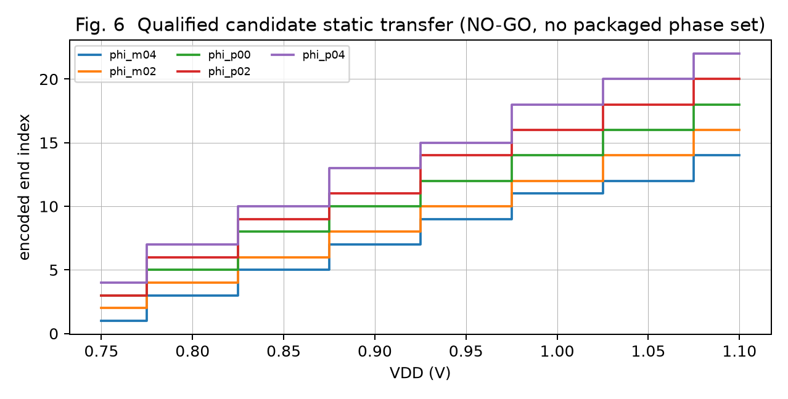
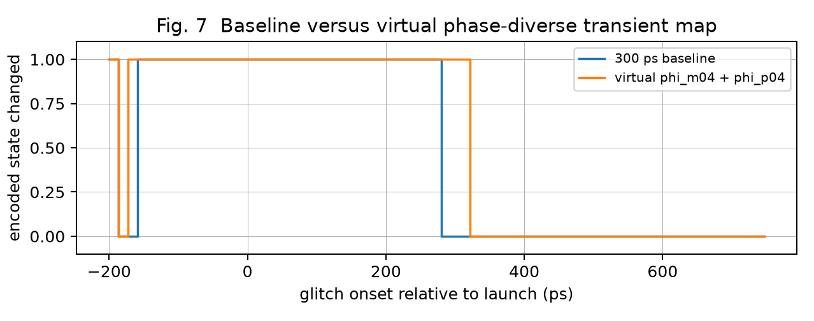

# FTC Phase-Diverse Sampling Result

## A. Motivation From The NO-GO Result

The completed single-snapshot study measured acute voltage/phase angles of 5.04 deg (1.10 V), 15.42 deg (0.90 V), and 26.57 deg (0.75 V); its 15.42 deg median was below the 30 deg screening gate. The global C/W projection remains closed.

## B. Phase-Diversity Hypothesis

This study did not attempt another algebraic phase-rejection transform. It held the shared RVT/LVT/XOR physical front-end fixed and tested whether deliberately separated capture phases have complementary physical transient apertures.

## C. Candidate Phase Qualification

Nine phases from 245.126260 ps to 354.873740 ps were physically measured. All nine were valid at 1.10/0.90/0.75 V and all eight coarse points; five evenly distributed phases were used for bounded transient screening.

Table 1. Candidate phases and static qualification.
| Phase | Anchor valid | Coarse valid | States | Largest jump | Boundary points |
| --- | --- | --- | --- | --- | --- |
| phi_m01 | 1 | 1 | 8 | 4 | 1 |
| phi_m02 | 1 | 1 | 8 | 4 | 1 |
| phi_m03 | 1 | 1 | 8 | 4 | 2 |
| phi_m04 | 1 | 1 | 8 | 4 | 2 |
| phi_p00 | 1 | 1 | 8 | 5 | 1 |
| phi_p01 | 1 | 1 | 8 | 5 | 1 |
| phi_p02 | 1 | 1 | 8 | 5 | 1 |
| phi_p03 | 1 | 1 | 8 | 5 | 1 |
| phi_p04 | 1 | 1 | 8 | 5 | 1 |

## D. Phase-Specific Nominal States

| Phase | Capture phase (ps) | Captured word | Start | End | Length |
| --- | --- | --- | --- | --- | --- |
| phi_m02 | 272.563130 | `000000000111111110000000000000` | 9 | 16 | 8 |
| phi_m04 | 245.126260 | `000000001111111000000000000000` | 8 | 14 | 7 |
| phi_p00 | 300.000000 | `000000000011111111100000000000` | 10 | 18 | 9 |
| phi_p02 | 327.436870 | `000000000000111111111000000000` | 12 | 20 | 9 |
| phi_p04 | 354.873740 | `000000000000011111111110000000` | 13 | 22 | 10 |

## E. Glitch Phase Map

The physical map uses a 200 mV, 200 ps droop and 13.718435 ps coarse onset bins. No inferred C/W geometry was used.

## F. Blind-Window Complementarity

The post-capture blind interval is shared by all tested phases. The raw best pair `phi_m04 + phi_p04` retains a 438.990 ps longest common blind interval, equal to the best individual phase; this is the decisive absence of useful physical complementarity.

## G. Phase-Set Selection

| Set size | Best phase set | Longest common blind (ps) | Worst detection |
| --- | --- | --- | --- |
| 1 | phi_p02 | 438.990 | 0.5000 |
| 2 | phi_m04+phi_p04 | 438.990 | 0.5286 |
| 3 | phi_m02+phi_m04+phi_p04 | 438.990 | 0.5286 |

Table 2. All measured two-phase virtual same-launch combinations.

| Phase pair | Longest common blind (ps) | Worst detection |
| --- | --- | --- |
| phi_m04+phi_p04 | 438.990 | 0.5286 |
| phi_m02+phi_p04 | 438.990 | 0.5143 |
| phi_m04+phi_p02 | 438.990 | 0.5143 |
| phi_p00+phi_p02 | 438.990 | 0.5143 |
| phi_p00+phi_p04 | 438.990 | 0.5143 |
| phi_p02+phi_p04 | 438.990 | 0.5143 |
| phi_m02+phi_p02 | 438.990 | 0.5000 |
| phi_m04+phi_p00 | 480.145 | 0.4857 |
| phi_m02+phi_p00 | 480.145 | 0.4714 |
| phi_m02+phi_m04 | 507.582 | 0.4429 |

A third phase gives no reduction in the measured longest common blind interval; no four-phase or LFSR expansion was attempted.

## H. Jitter-Aware Result

At 1.10 V, both `phi_m04` and `phi_p04` have a measured maximum no-glitch boundary movement of two taps. After applying those envelopes, their pair retains a 452.708 ps common blind interval, again identical to its best individual member.

## I. Sequential Versus Parallel

`A,B,A,B...` is reported separately. For the 200 ps one-shot map, unknown-parity sequential coverage is 0.3929, worst-phase coverage is 0.3571, and it does not use same-launch OR. Persistent two-cycle coverage was not measured because the stimulus is shorter than the 6 ns sampling period.

## J. Physical Phase Generation

Not implemented: the ideal-phase data failed the complementarity decision gate, so a real-cell phase generator would add unvalidated cost and would violate the minimum-hardware rule.

## K. Static Sensing Preservation

All candidates preserved valid 0.75--1.10 V coarse static sensing. A final 10 mV selected-phase sweep is not applicable because no architecture and no physical phase set passed the gate.

## L. Final Transient Coverage

No packaged phase-diverse hardware exists. Fig. 7 compares the 300 ps baseline with the virtual best pair solely to show why final hardware characterization was not authorized. The full-cycle sequential report also gives a 5.253 ns unobserved-interval lower bound.

## M. Hardware Cost

Table 3. Selected architecture hardware cost.
| Item | Baseline | Phase-diverse packaged addition |
| --- | --- | --- |
| RVT delay buffers | 34 | 0 (NO-GO) |
| LVT delay buffers | 30 | 0 (NO-GO) |
| XOR cells | 30 | 0 (NO-GO) |
| Capture latches | 30 | 0 (NO-GO) |
| Capture FFs | 30 | 0 (NO-GO) |
| Phase-generator cells / baseline registers / fusion | 0 | 0 (not implemented) |

No DC timing/area or PVT batch was run because the plan requires those only after an architecture and real-cell phase generator are selected.

## N. Limitations

The result covers TT/25 C, five bounded ideal capture phases, and one physically measured medium glitch family. It does not claim that phase diversity removes cadence blind windows; short glitches can still occur outside the aperture. A future direction must change cadence, use asynchronous/event-driven capture, or change the physical aperture rather than add more phases indefinitely.

## O. Final Architectural Conclusion

**NO-GO: phase diversity does not materially reduce measured blind windows.** The best raw two-phase virtual union has the same 438.990 ps longest common blind interval as the best single phase; after measured jitter tolerance, the best pair still has the same 452.708 ps longest common blind interval as its best individual member. Therefore no parallel capture RTL, phase generator, boot calibration hardware, final static sweep, PVT study, or synthesis cost claim is justified.
