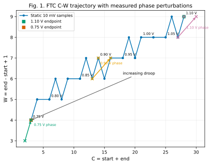
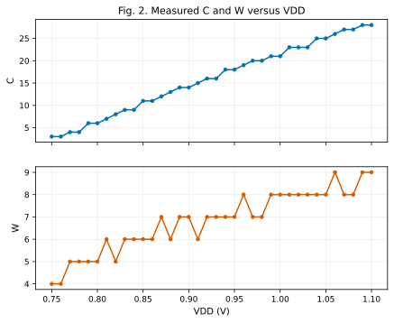
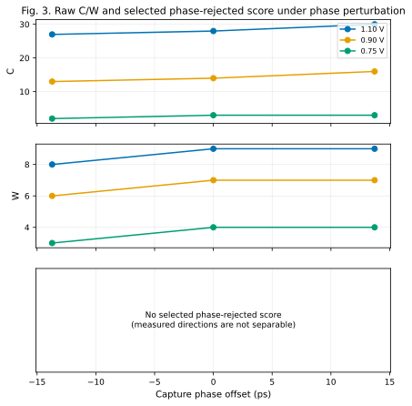
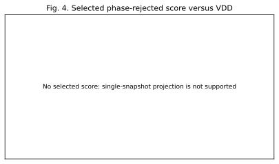

# FTC Phase/Voltage 2-D Separability

## A. Research question

This analysis asks whether the existing FTC `(start,end)` output contains a voltage-sensitive direction separable from sampling-phase motion, without changing the physical sensor.

## B. Baseline and data provenance

- Formal range: 0.75--1.10 V; TT/25 C completed FTC RVT/LVT reproduction.
- Selected operating point: four RVT initial stages, zero LVT initial stages, 300 ps capture phase, 30 observable stages.
- Static source: `/home/zhupl25/chiplet_side_channel/chiplet_gds_data/power_macro/delay_chain/ftc/runs/static_fine/static_transfer.csv` (36 valid 10 mV samples).
- Phase source: `/home/zhupl25/chiplet_side_channel/chiplet_gds_data/power_macro/delay_chain/ftc/runs/phase_sensitivity/phase_sensitivity.csv` (three offsets at 1.10, 0.90, and 0.75 V).
- No new HSPICE run, deck generation, or FTC structural change was performed.

## C. Feature definition

`C = start + end` represents the measured spatial position of the longest XOR window, and `W = end - start + 1` represents its measured width/path-separation information. These are working interpretations of this measured FTC output, not claims of invariant physical modes.

## D. Static C-W trajectory

Across the measured range, C changes from 28 to 3 (delta -25) and W changes from 9 to 4 (delta -5). The static response is primarily window translation (C change).

Representation state counts: `(start,end)`=21, `C`=21, `W`=6, `(C,W)`=21.

## E. Sampling-phase vectors

| VDD | C-/W- | C0/W0 | C+/W+ | vPhi | Status |
| --- | --- | --- | --- | --- | --- |
| 1.10 V | 27/8 | 28/9 | 30/9 | (3, 1) | measured movement |
| 0.90 V | 13/6 | 14/7 | 16/7 | (3, 1) | measured movement |
| 0.75 V | 2/3 | 3/4 | 3/4 | (1, 1) | measured movement |

## F. Separability metrics

| VDD | vV (droop) | vPhi | |cos| | Acute angle | Interpretation |
| --- | --- | --- | --- | --- | --- |
| 1.10 V | (-60, -14.3) | (3, 1) | 0.996 | 5.04 deg | near-collinear |
| 0.90 V | (-67.9, -3.57) | (3, 1) | 0.964 | 15.42 deg | near-collinear |
| 0.75 V | (-68.6, -22.9) | (1, 1) | 0.894 | 26.57 deg | near-collinear |

The pooled phase direction is `[0.936102744015548, 0.35172667320884415]`. It is a derived global approximation only; per-anchor metrics above remain the decision evidence.

## G. Projection experiment

No float or integer phase-rejected score was selected: `skipped_near_collinear`. median acute separation 15.422 deg is below the 30.0 deg screening gate

| Candidate search status | Reason |
| --- | --- |
| skipped_near_collinear | median acute separation 15.422 deg is below the 30.0 deg screening gate |

## H. Local ambiguity analysis

| Metric | VDD | Phase span | Local ~20 mV span | Ratio | Status |
| --- | --- | --- | --- | --- | --- |
| C | 1.10 V | 3 | 1 | 3 | defined |
| C | 0.90 V | 3 | 1 | 3 | defined |
| C | 0.75 V | 1 | 1 | 1 | defined |
| W | 1.10 V | 1 | 1 | 1 | defined |
| W | 0.90 V | 1 | 1 | 1 | defined |
| W | 0.75 V | 1 | 1 | 1 | defined |

## I. Limitations

- Only already measured TT/25 C physical evidence is used.
- Phase characterization exists at only three VDD anchors; this is not PVT robustness evidence.
- Quantized start/end codes make local derivatives discrete and can expose plateaus.
- No phase-invariance claim is made beyond the measured three-offset data.

## J. NO-GO - move to phase-diverse sampling

- Measured voltage and phase directions do not justify a global single-snapshot rejection axis.
- A low-complexity projection was not selected; tuning integer weights would not add physical evidence.
- Retain the existing FTC front-end and study phase-diverse / multi-phase sampling next.
