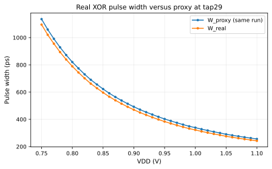
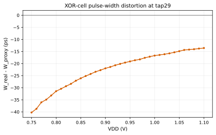

# FTC Real XOR Pulse-Width Validation

## A. Why this experiment

The prior GO established `|t_RVT - t_LVT|` as a VDD feature, not the high-pulse width at a physical XOR output. This experiment measures that output directly at tap29.

## B. Exact physical topology

- SMIC40LL TT / 25 C; RVT `BUF_X0P7M_A9TR40`; LVT `BUF_X0P7M_A9TL40`.
- 4 RVT initial stages, 0 LVT initial stages, 30 observable stages, and the full 30-real-XOR bank.
- XOR cell `XOR2_X0P5M_A9TR40`; measured output `xor_29`; normal isolated rising launch; 1 ps transient maximum step.

## C. Anchor result

| VDD (V) | W_proxy (ps) | W_real (ps) | Width error (ps) | Peak/VDD | Valid |
|---:|---:|---:|---:|---:|---:|
| 1.10 | 255.807 | 242.236 | -13.570 | 1.085 | 1 |
| 1.00 | 338.937 | 322.244 | -16.693 | 1.094 | 1 |
| 0.90 | 492.133 | 470.158 | -21.975 | 1.102 | 1 |
| 0.80 | 820.436 | 789.004 | -31.432 | 1.103 | 1 |
| 0.75 | 1135.821 | 1095.566 | -40.254 | 1.119 | 1 |

Anchor decision: **GO**.
- All five anchors have complete pulses and strictly increase as VDD decreases.

## D. Fine transfer

- Monotonic class: `strict_increasing`; plateaus: 0; reverse steps: 0.
- Real span: 853.330 ps; adjacent 10 mV movement min/median/max: 6.112/17.049/74.994 ps.
- |dW_real/dVDD| min/median/max: 61.125/170.485/749.941 ps / 100 mV.
- Width error min/median/max: -40.254/-20.411/-13.570 ps; width ratio min/median/max: 0.947/0.954/0.965.

## E. Physical interpretation

All 36 measured outputs retain complete VDD/2 rise/fall pulses. `W_real` preserves the proxy transfer direction without calibration.
Width error changes from -40.254 to -13.570 ps across VDD, so the XOR contribution is VDD-dependent distortion rather than a constant offset; its measured ratio remains within 0.947--0.965.
No threshold, TDC, PVT, or glitch architecture is inferred from this physical-transfer result.

## F. Final decision

**GO**
- All 36 points have complete pulses and strictly increase as VDD decreases.
