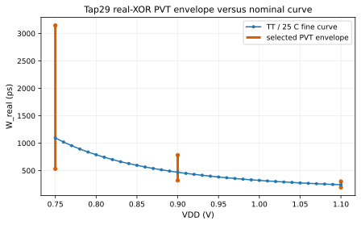
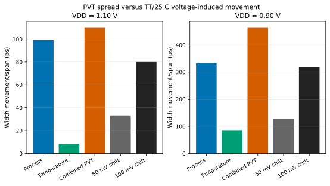
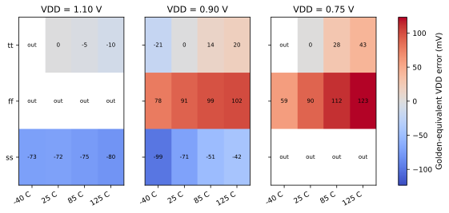

# FTC Tap29 Real-XOR PVT Baseline Characterization

This report reuses the approved TT/25 C 36-point `fine.csv` baseline. It measures only the frozen 4-RVT/0-LVT, 30-stage, full-real-XOR-bank `xor_29` topology with a 1 ps transient maximum step.

## Q1. Process variation 有多大？

| Process corner | W_real @ 1.10 V (ps) | W_real @ 0.90 V (ps) | W_real @ 0.75 V (ps) |
|---|---:|---:|---:|
| tt | 242.236 | 470.158 | 1095.566 |
| ff | 195.698 | 331.223 | 627.923 |
| ss | 294.874 | 664.328 | 1974.084 |
| fnsp | 250.187 | 490.132 | 1165.069 |
| snfp | 239.012 | 482.603 | 1237.147 |

| VDD (V) | Process span (ps) |
|---:|---:|
| 1.10 | 99.176 |
| 0.90 | 333.105 |
| 0.75 | 1346.160 |

## Q2. Temperature variation 有多大？

| Temperature (C) | W_real @ 1.10 V (ps) | W_real @ 0.90 V (ps) | W_real @ 0.75 V (ps) |
|---:|---:|---:|---:|
| -40 | 239.921 | 517.645 | 1482.370 |
| 25 | 242.236 | 470.158 | 1095.566 |
| 85 | 245.115 | 442.698 | 904.969 |
| 125 | 248.409 | 431.839 | 824.818 |

| VDD (V) | Temperature span (ps) | Temperature behavior |
|---:|---:|---|
| 1.10 | 8.488 | `strict_increasing_with_temperature` |
| 0.90 | 85.807 | `strict_decreasing_with_temperature` |
| 0.75 | 657.553 | `strict_decreasing_with_temperature` |

## Q3. PVT spread 与 voltage sensitivity 相比是什么量级？

| VDD (V) | Combined PVT span (ps) | 50 mV shift (ps) | 100 mV shift (ps) | PVT/50 mV | PVT/100 mV |
|---:|---:|---:|---:|---:|---:|
| 1.10 | 109.852 | 33.184 | 80.007 | 3.310 | 1.373 |
| 0.90 | 463.069 | 126.319 | 318.846 | 3.666 | 1.452 |

## Q4. 固定 TT/25 C Golden Model 会产生多大等效 VDD 偏差？

- max |golden_equivalent_error_mV|: 123.277 mV
- median |golden_equivalent_error_mV|: 64.661 mV
- out_of_nominal_curve scenarios: 10.
- worst scenario: `{'V_equiv_golden': 0.8732768238790427, 'corner': 'ff', 'golden_equivalent_error_mV': 123.27682387904271, 'out_of_nominal_curve': 0, 'scenario_id': 'ff_125c_v0p75', 'temperature_c': 125.0, 'vdd_v': 0.75}`.

## Research conclusion

**PVT_IMPACT = DOMINANT**
- 1.10 V: combined PVT span > 100 mV width shift.
- 0.90 V: combined PVT span > 100 mV width shift.

至少一个 anchor 的 combined PVT span 超过 100 mV 脉宽特征，因此固定 TT/25 C Golden Model 对该范围不够稳健；self-calibration / programmable reference 具有明确的定量研究必要性。

在当前已验证的 tap29 真实 XOR 脉宽传感前端中，以上实测 process/temperature 基线漂移及其相对 50 mV、100 mV VDD 脉宽特征的量级关系，定量说明固定 TT/25 C Golden Model 的适用边界，并为下一阶段自校准可编程时间参考提供输入；本报告未实现或验证任何自校准电路。
