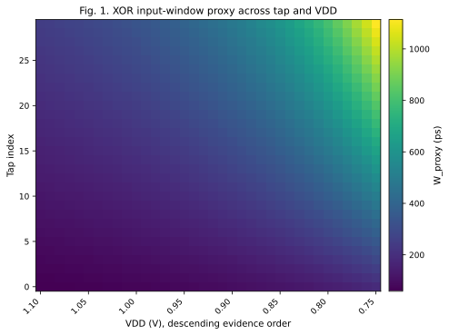
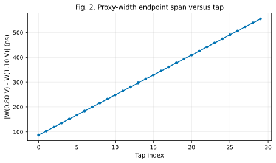
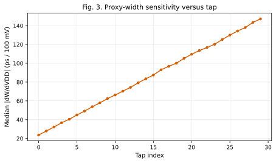
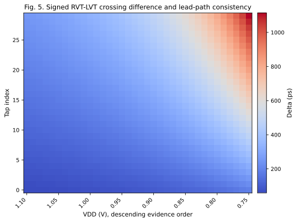
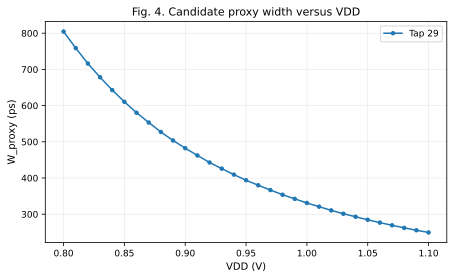

# FTC XOR Pulse-Width Proxy to VDD Mapping

## A. Motivation

Fixed-time spatial snapshots previously exposed phase dependence and temporal blind windows. This analysis does not change capture phase or launch cadence; it checks whether existing RVT/LVT differential delay itself supplies a useful time-domain feature.

## B. Input Evidence

- Primary source: `/home/zhupl25/chiplet_side_channel/chiplet_gds_data/power_macro/delay_chain/ftc/runs/range_080_110_republication/r1_check/filtered_inputs/static_transfer_080_110.csv` (31-point fine evidence; 31 VDD points).
- Repeat-phase consistency source: `/home/zhupl25/chiplet_side_channel/chiplet_gds_data/power_macro/delay_chain/ftc/runs/range_080_110_republication/r1_check/filtered_inputs/phase_coarse_all_080_110.csv`.
- Completed operating point: SMIC40LL TT/25 C, 4 RVT initial stages, 0 LVT initial stages, 30 observable stages, 300 ps capture phase.
- No new HSPICE run, deck generation, FTC configuration change, or hardware change was performed.

## C. Definition and Boundary

For corresponding tap `i`, `Delta_i = t_RVT_i - t_LVT_i` and `W_proxy_i = |Delta_i|`, reported in ps. `W_proxy` is the path-crossing-derived ideal XOR input window; it is not the output pulse width of a real XOR cell and therefore excludes cell delay, rise/fall asymmetry, inertial filtering, loading, and short-pulse attenuation.

## D. 30-tap Mapping

30 of 30 taps retain one nonzero lead sign across the measured range; total observed lead-path reversals are 0.

## E. Candidate Taps

| Tap | Lead path | Monotonicity | Span (ps) | Sensitivity (ps/100 mV) | Repeat margin (ps) | Reason |
| --- | --- | --- | --- | --- | --- | --- |
| 29 | LVT | strict_increasing | 555.093 | 147.227 | 33.409 | stable lead; strict_increasing; 0 plateau(s); positive 50 mV margin |

## F. Physical Interpretation

- Differential proxy width increases along the 30 measured taps at every available VDD.
- Tap 29 is the highest-ranked measured VDD-information location under the stated simple ranking order.
- Its median |dW/dVDD| is 71.432 ps/100 mV over the high-end five steps and 379.258 ps/100 mV over the low-end five steps; low-end sensitivity is higher in this evidence.
- No transistor-level mechanism is inferred beyond these measured crossing differences.

## G. Final Decision: GO

- 30 tap(s) have stable path order, strict measured monotonicity, and nonzero VDD movement.
- Existing repeat evidence is available and is used only as a same-run consistency check.
- Authorize only real XOR-output pulse-width validation of the shortlist; no readout architecture is selected.
